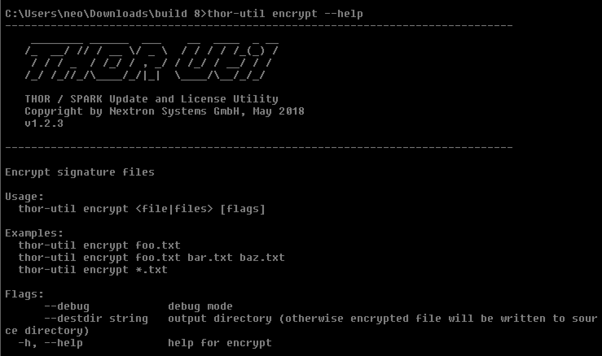

Custom Signature Encryption (encrypt)
=====================================

You can encrypt the YARA signatures and IOC files with the help of
THOR-Util's "encrypt" feature.

.. code:: doscon
   
   C:\thor>thor-util.exe encrypt --help

  
   THOR Util's Encrypt Feature Help

As target for the encrypt command, you can use a single file, a list of
files or wildcards.

.. code:: doscon 
 
   C:\thor>thor-util.exe encrypt ~/sigs/case14.yar                                                                
   C:\thor> hor-util.exe encrypt ~/sigs/case14.yar ~/sigs/case14-hashes.txt
   C:\thor>thor-util.exe encrypt ~/sigs/case14.\*

It will automatically detect the type of the signature based on its
extension.

.. list-table:: 
   :widths: 30, 40, 30
   :header-rows: 1

   * - File Type
     - Clear Text Extension
     - Extension of Encrypted File
   * - IOC File
     - .txt
     - .dat
   * - YARA Rule
     - .yar, .yara, .yac (compiled YARA)
     - .yas
   * - Sigma
     - .yml, .yaml
     - .yms
   * - STIXv2
     - .json
     - .jsos

Place the encrypted IOC files in the ``./custom-signatures`` sub folder in
the program directory and the encrypted YARA rules in the
``./custom-signatures/yara`` sub folder.
