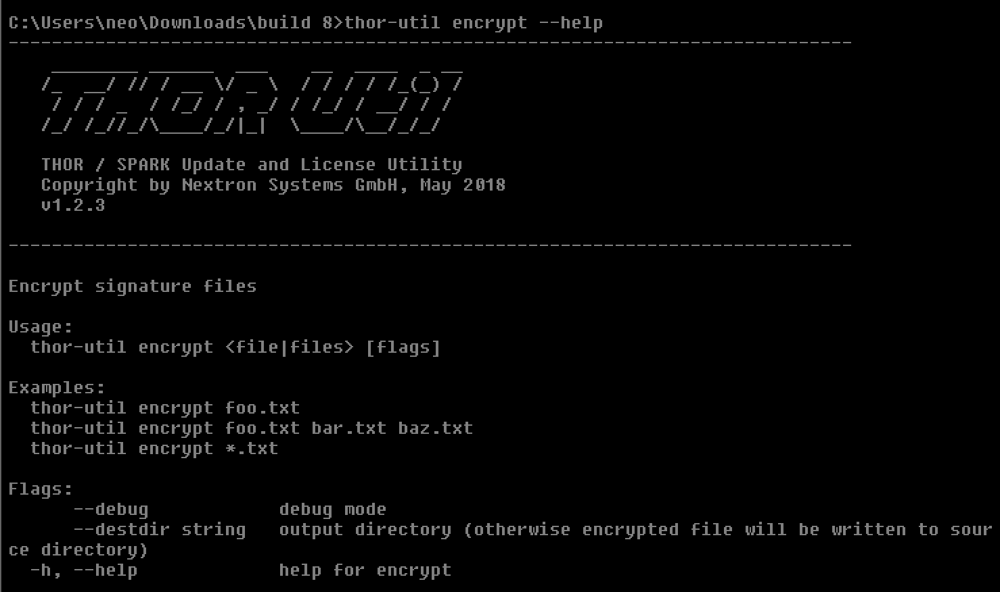

Custom Signature Encryption (encrypt)
=====================================

Use THOR Util's "encrypt" command to encrypt YARA signatures and IOC
files.

.. note::
   THOR Util and THOR Util Lite use different signature encryption methods. Custom signatures must therefore be encrypted using the corresponding version of THOR Util.

.. code:: doscon
   
   C:\thor>thor-util.exe encrypt --help

  
   THOR Util's Encrypt Feature Help

The "encrypt" command accepts a single file, a list of files, or
wildcards as input.

.. code:: doscon 
 
   C:\thor>thor-util.exe encrypt ~/sigs/case14.yar                                                                
   C:\thor>thor-util.exe encrypt ~/sigs/case14.yar ~/sigs/case14-hashes.txt
   C:\thor>thor-util.exe encrypt ~/sigs/case14.\*

THOR Util automatically detects the signature type based on the file
extension.

.. list-table:: 
   :widths: 30, 40, 30
   :header-rows: 1

   * - File Type
     - Clear Text Extension
     - Extension of Encrypted File
   * - IOC File
     - .txt
     - .dat
   * - YARA Rule
     - .yar, .yara, .yac (compiled YARA)
     - .yas
   * - Sigma
     - .yml, .yaml
     - .yms
   * - STIXv2
     - .json
     - .jsos

Place encrypted IOC files in the ``./custom-signatures`` subfolder in the
program directory and encrypted YARA rules in the
``./custom-signatures/yara`` subfolder.
