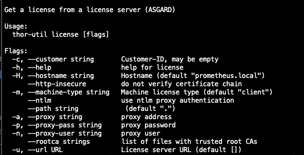
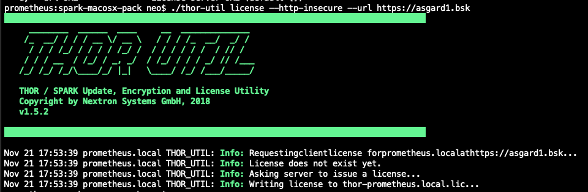

.. role:: raw-html-m2r(raw)
   :format: html

License Retrieval (license)
===========================

This feature can be used to retrieve a license from a remote ASGARD
server system.

   THOR Util's license generation feature

   License retrieval from an ASGARD server

.. code:: bash
 
   thor-util license --hostname machine1 server --url https://asgard1.bsk
   thor-util license --http-insecure --url https://asgard1.bsk
