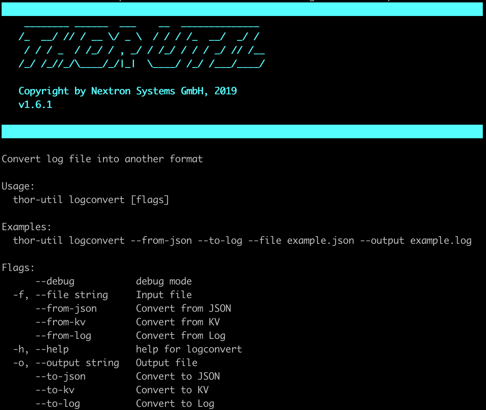

Log Conversion (logconvert)
===========================

The log conversion features allows to convert between Text and JSON
format.

   Log Conversion Options

.. code:: bash
 
   ./thor-util logconvert --from-log --to-json -f thor.log -o thor-converted.json
   ./thor-util logconvert --from-json --to-log -f thor.json -o thor-converted.log
