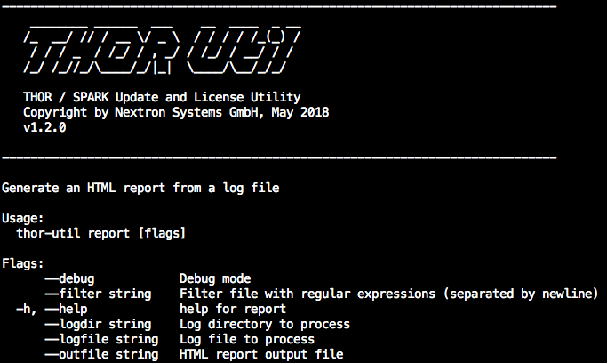
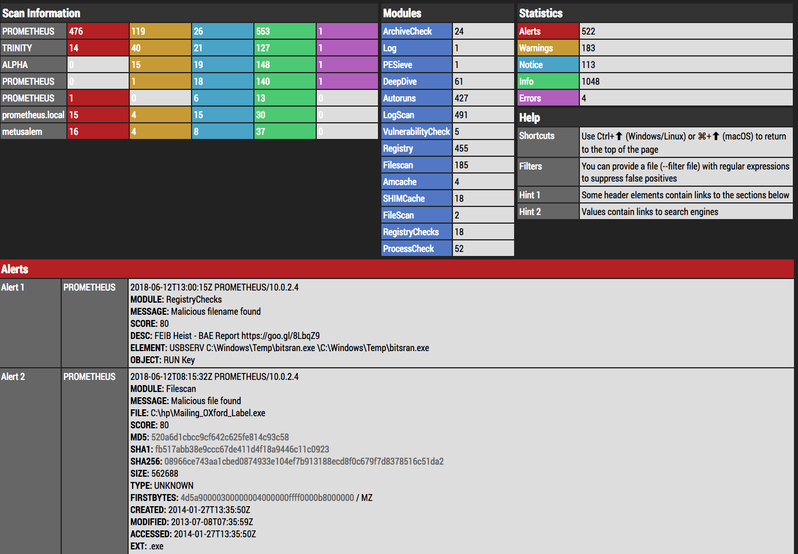

Report Generation (report)
==========================

Using the --report flag, you can generate HTML report from plain text
log files.

   THOR Util's report generation functions

.. code:: bash
 
   thor-util report --logfile PROMETHEUS\_thor.log
   thor-util report --logdir ./logs

   HTML report generated by thor-util

See this blog post for details:

https://www.nextron-systems.com/2018/06/20/thor-util-with-html-report-generation/
