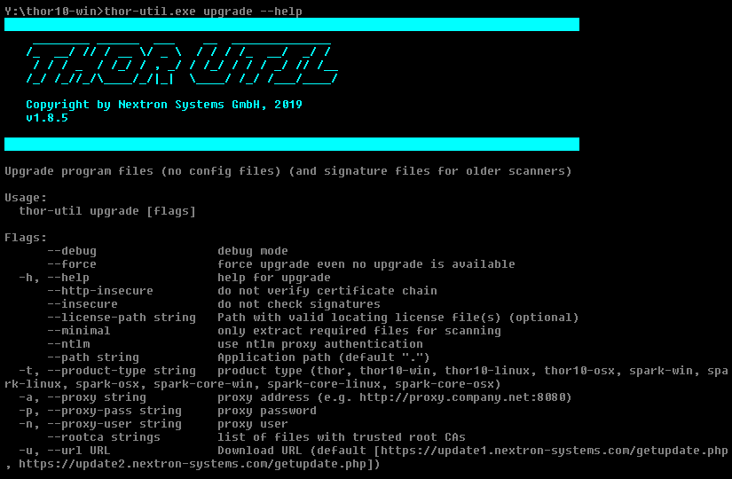
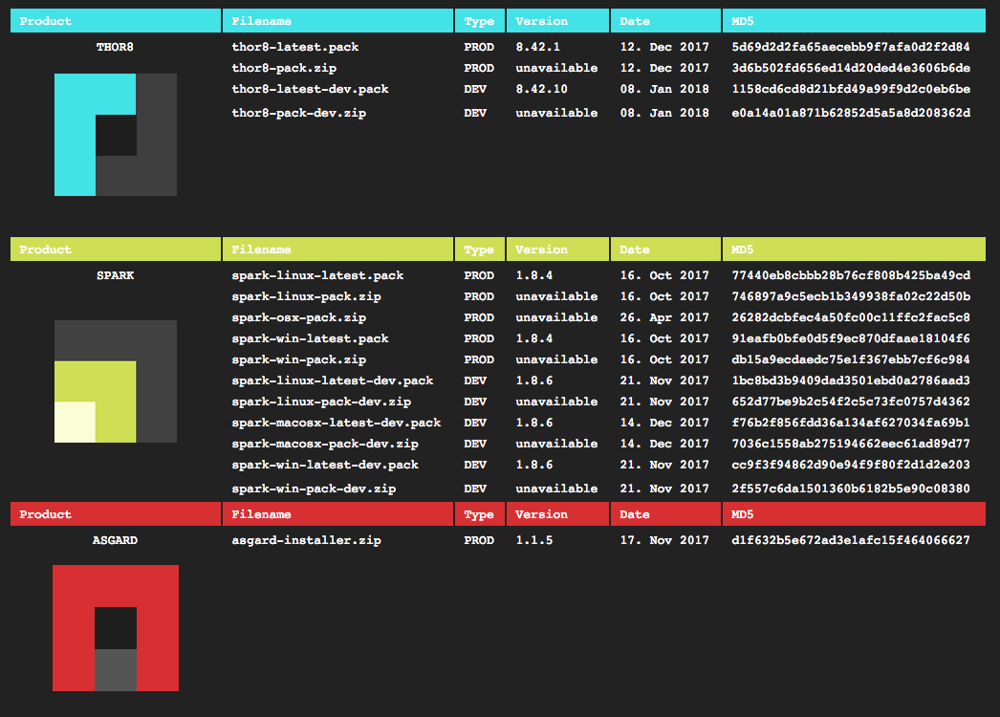

Upgrade (upgrade) and Updates (update)
======================================

You can download updates for THOR with ``thor-util.exe``
(Windows) or ``thor-util`` (Linux, macOS).

Running ``thor-util --help`` shows three options that seem to have a very
similar meaning: "upgrade", "update" and "download".

The difference is that the "download" option downloads a full pack with
all config files while the "upgrade" option fetches a full package but
excludes the config files to avoid accidental overwrites of local config
files (like: ``thor.yml``, ``falsepositive_filters.cfg``, etc.).

The "update" option retrieves only the newest signature pack (not the program files).

.. list-table:: 
   :widths: 35, 65
   :header-rows: 1

   * - Option
     - Description
   * - upgrade
     - Get new program files and signatures  
   * - update
     - Get new signatures
   * - download
     - Get new program files, signatures and config files

If you have a full program package present, you should use the "upgrade" option.

Every other option has its own help. You can see the help of each option with

.. code:: console
   
   user@unix:~/thor$ thor-util *option* --help

   THOR-util Upgrade Help

The following two examples show different upgrade methods.

.. code:: doscon
   
   C:\thor>thor-util.exe upgrade
   C:\thor>thor-util.exe upgrade -a https://proxy.company.net:8080
   C:\thor>thor-util.exe upgrade -a https://proxy.company.net:8080 -n dom\\user -p password
   C:\thor>thor-util.exe upgrade -a https://proxy.local:8080 --ntlm -n dom\\user -p password

THOR TechPreview Version
------------------------

To upgrade your current version to the TechPreview version, use the following command:

.. code:: doscon
   
   C:\thor>thor-util.exe upgrade --techpreview

You can find more information on the TechPreview version `here <https://www.nextron-systems.com/2020/08/31/introduction-thor-techpreview/>`_.

Update Locations
----------------

When using the full version of THOR, the following servers are used as update mirrors and should be
accessible via HTTPS:

.. code:: none 
   
   update1.nextron-systems.com
   update2.nextron-systems.com

When using THOR Lite, the following server is used instead and should be accessible:

.. code:: none

   update-lite.nextron-systems.com

.. hint::
   For a detailed and up to date list of our update and
   licensing servers, please visit https://www.nextron-systems.com/hosts/.

SigDev Signatures
-----------------

Usually it takes our internal testing 1-2 days to verify the quality of new rules.
In rare cases in which a new and severe threat has been discovered it could make
sense to use the newest and untested signatures that are still in our testing
process. (e.g. new vulnerability and public proof-of-concept code)

To retrieve the newest and untested signatures you can use the ``thor-util.exe update --sigdev`` flag.

To reset the signature set to the latest stable version use ``thor-util.exe update --force``.
(retrieve the stable set and enforce the download even if the current set is newer)

Update Server Information
-------------------------

You can get information on the available update packages on this site:

https://update1.nextron-systems.com/info.php

   Update server information
