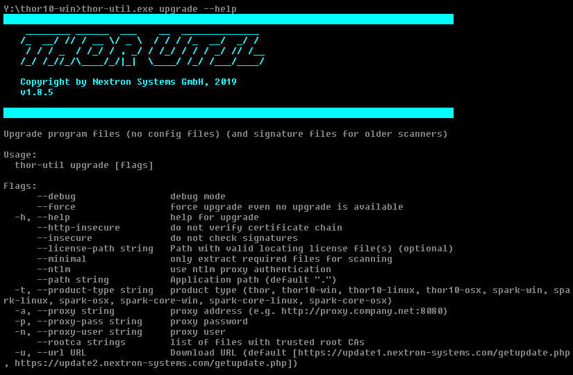
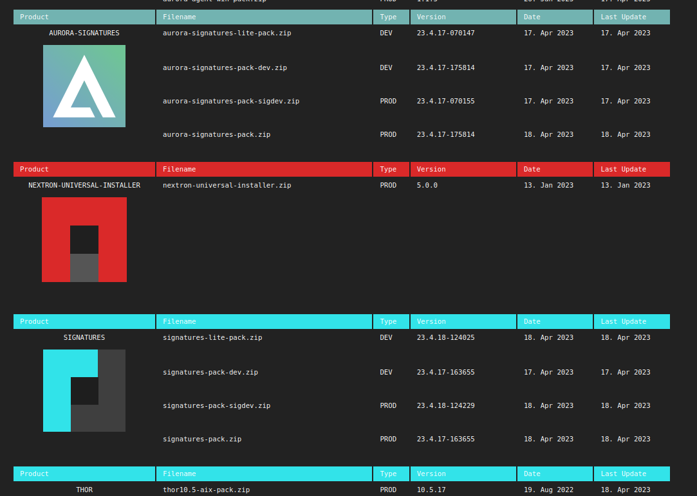

Upgrade (upgrade) and Updates (update)
======================================

You can download updates for THOR with ``thor-util.exe``
(Windows) or ``thor-util`` (Linux, macOS).

.. note:: 
   THOR Util cannot download THOR binaries and signatures whose license
   was obtained through the Management Center. Use the Management Center
   API for these downloads. THOR Util only accepts the Nextron Customer
   Portal as a license source.

Running ``thor-util --help`` shows three options that seem to have a very
similar meaning: "upgrade", "update" and "download".

The "download" option downloads a full package including all configuration
files. The "upgrade" option fetches a full package but excludes
configuration files to avoid overwriting local files such as ``thor.yml``
or ``falsepositive_filters.cfg``.

The "update" option retrieves only the newest signature pack (not the program files).

.. list-table:: 
   :widths: 35, 65
   :header-rows: 1

   * - Option
     - Description
   * - upgrade
     - Get new program files and signatures
   * - update
     - Get new signatures
   * - download
     - Get new program files, signatures, and configuration files

If a full program package is already present, use the "upgrade" option.

Each option has its own help. You can view it with:

.. code:: console
   
   user@unix:~/thor$ ./thor-util *option* --help

   THOR-util Upgrade Help

The following examples show different upgrade methods:

.. code:: doscon
   
   C:\thor>thor-util.exe upgrade
   C:\thor>thor-util.exe upgrade -a https://proxy.company.net:8080
   C:\thor>thor-util.exe upgrade -a https://proxy.company.net:8080 -n dom\\user -p password
   C:\thor>thor-util.exe upgrade -a https://proxy.local:8080 --ntlm -n dom\\user -p password

THOR TechPreview Version
------------------------

To upgrade your current version to the TechPreview version, use this command:

.. code:: doscon
   
   C:\thor>thor-util.exe upgrade --techpreview

You can find more information on the TechPreview version
`on our website <https://www.nextron-systems.com/2020/08/31/introduction-thor-techpreview/>`_.

.. hint:: 
   To make the TechPreview version persistent, consider adding it to your THOR Util
   configuration file (``thor-util.yml``). Please see :ref:`usage/templates:TechPreview configuration`.

Update Locations
----------------

When using the full version of THOR, the following update mirrors must be
accessible via HTTPS:

.. code:: none 
   
   update1.nextron-systems.com
   update2.nextron-systems.com

When using THOR Lite, the following server must be accessible:

.. code:: none

   update-lite.nextron-systems.com

.. hint::
   For a detailed and up-to-date list of our update and
   licensing servers, please visit https://www.nextron-systems.com/hosts/.

SigDev Signatures
-----------------

New signatures are usually validated for 1-2 days before they are published
as stable. In rare cases, such as a newly discovered severe threat or public
proof-of-concept code, you may want to use the latest SigDev signatures while
they are still in validation.

To retrieve the latest SigDev signatures, use the ``thor-util.exe update --sigdev`` flag.

To reset the signature set to the latest stable version, use ``thor-util.exe update --force``.
This retrieves the stable set and enforces the download even if the current set is newer.

Update Server Information
-------------------------

You can view information about the available update packages on this site:

https://update1.nextron-systems.com/info.php

   Update server information

Upgrading to a specific version
-------------------------------

To upgrade to a specific THOR version, use the ``--version`` flag:

.. code:: doscon

   C:\thor>thor-util.exe upgrade --version 10.7.27

.. hint::
   It is also possible to specify more complex expressions instead of a single version. The full syntax
   is described `here <https://github.com/Masterminds/semver#checking-version-constraints>`_.
   To e.g. upgrade to the latest THOR 10, you can use ``upgrade --version ^10.0.0``.

When ``--version`` is used, ``--techpreview`` is ignored.
