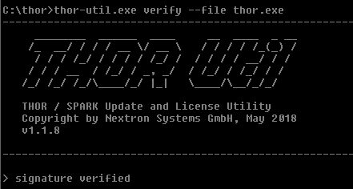

Verify Binaries (verify)
========================

This feature allows to verify the authenticity of the included binaries.
The signature verification is based on a public key encryption algorithm
and requires the ``*.sig`` files that are shipped with the packages.

   Verify thor.exe signature using THOR Util

To verify the integrity of THOR Util, download the public key used for the
verification on Nextrons Website: https://www.nextron-systems.com/pki/
The public key can be then used with the following command to verify the integrity of ``thor-util``:

on Windows:

.. code:: doscon

   openssl dgst -sha256 -verify codesign.pem -signature thor-util.exe.sig thor-util.exe

on Linux:

.. code:: console

   openssl dgst -sha256 -verify codesign.pem -signature thor-util.sig thor-util
